# CLAUDE.md - Atom Project AI Context Documentation

> **Last Updated:** 2026-01-15
> **Project Version:** 0.1.0
> **Documentation Version:** 1.2.0
> **Scan Date:** 2026-01-15

This document provides comprehensive AI context for the Atom project, enabling AI assistants to understand the architecture, module structure, and development workflows.

---

## Table of Contents

- [Project Overview](#project-overview)
- [Module Structure](#module-structure)
- [Architecture](#architecture)
- [Build System](#build-system)
- [Development Workflow](#development-workflow)
- [Testing Strategy](#testing-strategy)
- [Coding Standards](#coding-standards)
- [AI Usage Guidelines](#ai-usage-guidelines)
- [Change Log](#change-log)

---

## Project Overview

**Atom** is a foundational C++20/C++23 library for astronomical software development. It provides a comprehensive, modular framework with 18+ specialized domains designed for high-performance applications in astronomy, image processing, and system integration.

### Key Characteristics

- **Modular Architecture**: Each module can be built independently with explicit dependency management
- **Cross-Platform**: Windows (MSVC/MinGW64), Linux (GCC/Clang), macOS (Clang)
- **Modern C++**: C++20 baseline with C++23 features when available
- **Performance-Oriented**: SIMD, memory pooling, lock-free queues, custom allocators
- **Astronomy-Focused**: FITS/SER format support, image processing pipelines
- **Python Bindings**: Optional pybind11 bindings for most modules

### Project Metadata

| Attribute | Value |
|-----------|-------|
| **Version** | 0.1.0 |
| **License** | GPL-3.0 |
| **Homepage** | <https://github.com/ElementAstro/Atom> |
| **C++ Standard** | C++20 (C++23 when available) |
| **Minimum CMake** | 3.21 |
| **Primary Build** | CMake with presets |

---

## Module Structure

### Architecture Overview

```mermaid
graph TD
    A["Atom Project v0.1.0"] --> B["Core Modules (3)"]
    A --> C["Low-Level Modules (3)"]
    A --> D["Mid-Level Modules (4)"]
    A --> E["High-Level Modules (5)"]
    A --> F["Application-Level Modules (3)"]
    A --> G["Build & Test Infrastructure"]

    %% Core Modules (no dependencies)
    B --> B1["error<br/>Error handling"]
    B --> B2["type<br/>Type utilities"]
    B --> B3["containers<br/>Data structures"]

    %% Low-Level Modules
    C --> C1["log<br/>Logging framework"]
    C --> C2["meta<br/>Reflection"]
    C --> C3["memory<br/>Memory mgmt"]

    %% Mid-Level Modules
    D --> D1["utils<br/>General utilities"]
    D --> D2["algorithm<br/>Math & crypto"]
    D --> D3["async<br/>Async primitives"]
    D --> D4["io<br/>I/O operations"]

    %% High-Level Modules
    E --> E1["sysinfo<br/>System info"]
    E --> E2["system<br/>System integration"]
    E --> E3["serial<br/>Serial comms"]
    E --> E4["secret<br/>Security"]
    E --> E5["search<br/>Caching"]
    E --> E6["image<br/>Image processing"]

    %% Application-Level Modules
    F --> F1["connection<br/>Networking"]
    F --> F2["components<br/>Component system"]
    F --> F3["web<br/>Web utilities"]

    %% Supporting Structures
    G --> G1["tests<br/>291 test files"]
    G --> G2["example<br/>415 example files"]
    G --> G3["python<br/>Python bindings"]
    G --> G4["scripts<br/>Build scripts"]
    G --> G5["cmake<br/>CMake modules"]
    G --> G6["extra<br/>3rd party"]

    %% Dependencies
    B1 --> C1
    B1 --> C2
    B2 --> B3
    B1 --> C3
    B2 --> C3
    C2 --> C3
    B1 --> D1
    B2 --> D1
    B1 --> D2
    B1 --> D3
    B1 --> D4
    D3 --> D4
    B1 --> E1
    B1 --> E2
    B2 --> E2
    D1 --> E2
    B1 --> E3
    C1 --> E3
    B1 --> E5
    B1 --> E6
    D1 --> E6
    D4 --> E6
    B1 --> F1
    D3 --> F1
    B1 --> F2
    B2 --> F2
    B1 --> F3
    D1 --> F3
    D4 --> F3
    E2 --> F3
    B2 --> F3

    click D2 "./atom/algorithm/CLAUDE.md" "View algorithm module docs"
    click E6 "./atom/image/CLAUDE.md" "View image module docs"
    click F1 "./atom/connection/CLAUDE.md" "View connection module docs"
    click D3 "./atom/async/CLAUDE.md" "View async module docs"
    click B1 "./atom/error/CLAUDE.md" "View error module docs"
```



### Module Index

#### Core Modules

| Module | Path | Description | Dependencies | Documentation |
|--------|------|-------------|--------------|---------------|
| **error** | `atom/error/` | Comprehensive error handling with stack traces, contexts, and recovery | (base module) | [View](./atom/error/CLAUDE.md) |
| **log** | `atom/log/` | Async logging framework with rotation and memory-mapped sinks | error, utils | [View](./atom/log/CLAUDE.md) |
| **type** | `atom/type/` | Type utilities, variant/any helpers, small-vector | error, utils | [View](./atom/type/CLAUDE.md) |
| **meta** | `atom/meta/` | Reflection, type traits, property helpers, FFI utilities | error, utils | [View](./atom/meta/CLAUDE.md) |
| **utils** | `atom/utils/` | String/time, hashing, UUIDs, crypto helpers, CLI utilities | error, type | [View](./atom/utils/CLAUDE.md) |

#### Specialized Modules

| Module | Path | Description | Dependencies | Documentation |
|--------|------|-------------|--------------|---------------|
| **algorithm** | `atom/algorithm/` | Algorithms: compression, crypto, hashing, filters, pathfinding | type, utils, error | [View](./atom/algorithm/CLAUDE.md) |
| **async** | `atom/async/` | Futures/promises, executors, workers, messaging | utils | [View](./atom/async/CLAUDE.md) |
| **components** | `atom/components/` | Component system, pools, lifecycle management, ECS-like utilities | meta, utils | [View](./atom/components/CLAUDE.md) |
| **connection** | `atom/connection/` | TCP/UDP, FIFO/TTY, async sockets, pooling | async, system | [View](./atom/connection/CLAUDE.md) |
| **containers** | `atom/containers/` | Lock-free queues, intrusive/graph helpers (Boost optional) | type, utils | [View](./atom/containers/CLAUDE.md) |
| **image** | `atom/image/` | FITS/SER formats, transforms, filters, OCR/OpenCV (optional) | algorithm, io, async | [View](./atom/image/CLAUDE.md) |
| **io** | `atom/io/` | File ops, compression, globbing, async I/O | async, utils | [View](./atom/io/CLAUDE.md) |
| **memory** | `atom/memory/` | Memory pools, arenas, tracking, custom allocators | type, error | [View](./atom/memory/CLAUDE.md) |
| **search** | `atom/search/` | LRU/TTL caches, pluggable storage (SQLite/MySQL optional) | type, io | [View](./atom/search/CLAUDE.md) |
| **secret** | `atom/secret/` | Password/crypto helpers, secure storage | algorithm, io | [View](./atom/secret/CLAUDE.md) |
| **serial** | `atom/serial/` | Serial ports and adapters with cross-platform helpers | system, connection | [View](./atom/serial/CLAUDE.md) |
| **sysinfo** | `atom/sysinfo/` | CPU/mem/disk/GPU/network/system introspection | type, utils | [View](./atom/sysinfo/CLAUDE.md) |
| **system** | `atom/system/` | Process management, env/registry, scheduling, signals | sysinfo, meta, utils | [View](./atom/system/CLAUDE.md) |
| **web** | `atom/web/` | HTTP client, MIME helpers, URL tools, downloaders | utils, io, system | [View](./atom/web/CLAUDE.md) |

#### Supporting Structures

| Component | Path | Purpose |
|-----------|------|---------|
| **tests** | `tests/` | GoogleTest-based test suite with CTest integration |
| **example** | `example/` | Comprehensive examples demonstrating module usage |
| **python** | `python/` | pybind11 bindings for Python integration |
| **scripts** | `scripts/` | Build scripts, dependency management, packaging tools |
| **cmake** | `cmake/` | CMake modules for build configuration |
| **extra** | `extra/` | Third-party libraries (minizip, tinyxml2, spdlog, asio, etc.) |

---

## Architecture

### Module Organization

Each module follows a consistent structure:

```
atom/<module>/
├── CMakeLists.txt              # Module build configuration
├── <module>.hpp                # Main header (backwards compatibility)
├── core/                       # Core functionality
│   ├── <core_files>.hpp
│   └── <core_files>.cpp
├── <subcategory>/              # Functional subdirectories
│   ├── <files>.hpp
│   └── <files>.cpp
└── CLAUDE.md                   # Module documentation (if present)
```

### Dependency Management

- **Explicit Dependencies**: Each module declares dependencies in `cmake/ModuleDependenciesData.cmake`
- **Auto-Resolution**: Set `ATOM_AUTO_RESOLVE_DEPS=ON` to automatically enable required modules
- **Per-Module Toggles**: Use `ATOM_BUILD_<MODULE>=ON/OFF` for selective building
- **Build Order**: Modules are built in topological order to satisfy dependencies

### Key Dependencies

| Dependency | Purpose | Required | Modules Using |
|------------|---------|----------|---------------|
| **spdlog** | Logging framework | Yes | All modules |
| **fmt** | Formatting library | Yes (via spdlog) | All modules |
| **OpenSSL** | Cryptographic operations | Optional | algorithm, secret, utils |
| **OpenCV** | Computer vision | Optional | image |
| **CFITSIO** | FITS format support | Optional | image |
| **Tesseract** | OCR capabilities | Optional | image |
| **Leptonica** | Image processing for OCR | Optional | image (with Tesseract) |
| **Boost** | High-performance containers | Optional | containers |
| **ASIO** | Async I/O | Optional | connection, io |
| **ZLIB** | Compression | Optional | io, utils |
| **minizip-ng** | Advanced compression | Optional | io |
| **libusb-1.0** | USB device support | Optional | system |
| **pybind11** | Python bindings | Optional | python/ |
| **GTest** | Unit testing | Dev only | tests/ |

---

## Build System

### Primary Build Commands

```bash
# Quick start (Unix/Linux/macOS)
./scripts/build.sh --release --tests --examples

# Quick start (Windows)
scripts\build.bat --release --tests --examples

# Using CMake presets
cmake --preset release
cmake --build --preset release -j
```

### Build Options

#### Module Selection

```cmake
# Build all modules (default)
-DBUILD_ALL=ON

# Selective module building
-DATOM_BUILD_ALGORITHM=ON
-DATOM_BUILD_ASYNC=ON
-DATOM_BUILD_IMAGE=ON
# ... (one per module)
```

#### Feature Flags

```cmake
# Optional features
-DATOM_USE_OPENCV=ON               # Enable OpenCV for image processing
-DATOM_USE_CFITSIO=ON              # Enable FITS format support
-DATOM_USE_BOOST=ON                # Enable Boost containers
-DATOM_USE_BOOST_LOCKFREE=ON       # Enable Boost lock-free data structures
-DATOM_USE_BOOST_CONTAINER=ON      # Enable Boost container library
-DATOM_USE_BOOST_GRAPH=ON          # Enable Boost graph library
-DATOM_USE_BOOST_INTRUSIVE=ON      # Enable Boost intrusive containers
-DATOM_USE_SSH=ON                  # Enable SSH support
-DATOM_USE_MINIZIP=ON              # Enable minizip-ng for advanced compression
-DATOM_USE_LIBUV=ON                # Enable libuv for async I/O
-DATOM_USE_TBB=ON                  # Enable Intel TBB for parallel algorithms
-DATOM_BUILD_PYTHON_BINDINGS=ON    # Build Python bindings
```

#### Build Types

```cmake
-DCMAKE_BUILD_TYPE=Debug          # Debug build with symbols
-DCMAKE_BUILD_TYPE=Release        # Optimized release build
-DCMAKE_BUILD_TYPE=RelWithDebInfo # Release with debug info
```

### Build Presets

Available CMake presets (defined in `CMakeUserPresets.json`):

- `debug` - Debug build with symbols
- `release` - Optimized release build
- `relwithdebinfo` - Release with debug info
- `debug-msys2` - MSYS2 MinGW64 debug build
- `release-vs` - MSVC release build

### Platform-Specific Notes

#### Windows (MSVC)

```bash
# Use vcpkg for dependencies
cmake -B build -DCMAKE_TOOLCHAIN_FILE=vcpkg/scripts/buildsystems/vcpkg.cmake
```

#### Windows (MSYS2 MinGW64)

```bash
# Ensure ASIO is available
pacman -S mingw-w64-x86_64-asio
```

#### Linux/macOS

```bash
# Install system dependencies
sudo apt-get install libspdlog-dev libopencv-dev libcfitsio-dev
```

---

## Development Workflow

### Project Structure

```
Atom/
├── atom/                   # Core library modules
├── tests/                  # Test suite
├── example/                # Usage examples
├── python/                 # Python bindings
├── scripts/                # Build and utility scripts
├── cmake/                  # CMake modules
├── extra/                  # Third-party libraries
├── docs/                   # Documentation
├── .claude/                # AI context (index.json, this file)
├── CMakeLists.txt          # Root CMake configuration
├── README.md               # Project overview
└── CLAUDE.md               # This file
```

### Adding New Code

1. **Select Module**: Choose appropriate module under `atom/`
2. **Add Headers**: Place public headers in module root or subdirectories
3. **Add Implementation**: Place `.cpp` files in subdirectories
4. **Update CMakeLists.txt**: Add sources to build configuration
5. **Add Tests**: Create tests under `tests/<module>/`
6. **Add Examples**: Create examples under `example/<module>/`
7. **Update Documentation**: Modify `CLAUDE.md` files as needed

### Coding Standards

- **C++ Standard**: C++20 (C++23 features when available)
- **Indentation**: 4 spaces (no tabs)
- **Line Length**: 80 characters (soft limit)
- **Naming Conventions**:
  - Variables/functions: `snake_case`
  - Classes: `PascalCase`
  - Constants: `UPPER_SNAKE_CASE`
  - Private members: `trailing_underscore_`
- **Documentation**: Doxygen comments for public APIs
- **Formatting**: clang-format (see `.clang-format`)

### Error Handling

All modules should integrate with the `atom::error` system:

```cpp
#include "atom/error/error.hpp"

try {
    // Your code here
} catch (const atom::error::Exception& e) {
    // Handle error with context
    ATOM_ERROR("Operation failed: {}", e.what());
}
```

### Logging

Use the unified logging framework:

```cpp
#include "atom/log/log.hpp"

ATOM_INFO("Processing image: {}", filename);
ATOM_WARN("High memory usage: {} MB", usage);
ATOM_ERROR("Failed to load: {}", error);
```

---

## Testing Strategy

### Test Framework

- **C++ Tests**: GoogleTest with CTest integration
- **Python Tests**: pytest (if Python bindings are built)
- **Coverage**: gcov/lcov (Linux), OpenCppCoverage (Windows)

### Running Tests

```bash
# Build and run all tests
./scripts/build.sh --tests --run-tests

# Run specific test module
cd build
ctest -R "algorithm_*" --output-on-failure

# Run tests with coverage
ctest --preset coverage
```

### Test Organization

Tests are organized by module under `tests/`:

```
tests/
├── algorithm/          # Algorithm module tests
├── async/              # Async module tests
├── components/         # Components module tests
├── connection/         # Connection module tests
├── containers/         # Containers module tests
├── error/              # Error module tests
├── image/              # Image module tests
├── io/                 # IO module tests
├── log/                # Log module tests
├── memory/             # Memory module tests
├── meta/               # Meta module tests
├── search/             # Search module tests
├── secret/             # Secret module tests
├── serial/             # Serial module tests
├── sysinfo/            # Sysinfo module tests
├── system/             # System module tests
├── type/               # Type module tests
├── utils/              # Utils module tests
├── web/                # Web module tests
└── CMakeLists.txt      # Test suite configuration
```

### Test Categories

- **Unit Tests**: Test individual functions and classes
- **Integration Tests**: Test module interactions
- **Performance Tests**: Benchmark critical paths
- **Platform Tests**: Verify platform-specific code

---

## Coding Standards

### File Organization

- **Headers** (`.hpp`): Public interfaces, placed in module root or subdirectories
- **Sources** (`.cpp`): Implementations, placed in subdirectories
- **Main Headers**: Each module has a main `<module>.hpp` for backwards compatibility

### Include Guards

Use `#pragma once` for header guards:

```cpp
#pragma once

// Header content
```

### Namespace Conventions

All code is in the `atom` namespace, with module-specific subnamespaces:

```cpp
namespace atom {
namespace algorithm {

// Algorithm module code

}  // namespace algorithm
}  // namespace atom
```

### Documentation Standards

Use Doxygen-style comments:

```cpp
/**
 * @brief Brief description
 *
 * Detailed description of the function/class.
 *
 * @param param1 Description of parameter 1
 * @param param2 Description of parameter 2
 * @return Description of return value
 * @throws atom::error::Exception Description of when exception is thrown
 */
```

---

## AI Usage Guidelines

### When Working with Atom

1. **Understand Module Dependencies**: Always check `cmake/ModuleDependenciesData.cmake` before suggesting changes
2. **Respect Build System**: Use `atom_configure_module()` for consistent module configuration
3. **Follow Patterns**: Each module follows consistent patterns - study existing code before adding new features
4. **Test Everything**: Add tests for all new functionality in `tests/<module>/`
5. **Document Public APIs**: Use Doxygen comments for all public interfaces

### Common Tasks

#### Adding a New Module

1. Create directory under `atom/<new_module>/`
2. Create `CMakeLists.txt` using `atom_configure_module()`
3. Add module to root `atom/CMakeLists.txt` module list
4. Add dependencies to `cmake/ModuleDependenciesData.cmake`
5. Create module documentation in `atom/<new_module>/CLAUDE.md`
6. Add tests in `tests/<new_module>/`
7. Add examples in `example/<new_module>/`

#### Adding Dependencies

1. Add dependency check in module's `CMakeLists.txt`
2. Use `find_package()` with `QUIET` for optional deps
3. Conditionally compile with `#ifdef` checks
4. Document in module's `CLAUDE.md`

#### Writing Tests

1. Create test file in `tests/<module>/test_<feature>.cpp`
2. Use GoogleTest macros: `TEST()`, `EXPECT_*`, `ASSERT_*`
3. Add to `tests/<module>/CMakeLists.txt`
4. Run with `ctest -R <module>_.*`

### Module-Specific Guidelines

Refer to individual module `CLAUDE.md` files for:

- **algorithm**: Math/crypto algorithms, GPU acceleration
- **async**: Futures, promises, executors, messaging
- **image**: FITS/SER formats, transforms, OCR, OpenCV
- **connection**: TCP/UDP, async sockets, pooling
- **error**: Stack traces, error contexts, exception handling
- **system**: Platform-specific code, process management

---

## Change Log

### 2026-01-15

- Updated documentation scan with current repository state
- Total repository: 24,277 files, 4,129 directories
- Verified all 19 modules have CLAUDE.md documentation
- Updated module index with links to all module documentation
- Documentation version updated to 1.2.0

### 2025-01-15

- Updated documentation with comprehensive scan results
- Added file statistics and coverage information
- Updated module index with all 19 modules
- Enhanced build system documentation with all feature flags
- Added platform-specific notes for all dependencies
- Documented test organization across all modules
- Added comprehensive dependency information

### 2025-01-15 (Initial)

- Initial comprehensive AI context documentation
- Added module structure documentation with Mermaid diagram
- Documented build system, testing strategy, and coding standards
- Created module-level documentation framework

### Previous Changes

See git history for detailed change log.

---

## Additional Resources

### Internal Documentation

- [Module Documentation](./atom/) - Detailed module-specific documentation
- [Build System Guide](./cmake/README.md) - CMake build system details
- [Examples](./example/) - Comprehensive usage examples
- [SOP Documents](./llmdoc/sop/) - Standard Operating Procedures

### External Resources

- [CMake Documentation](https://cmake.org/documentation/)
- [GoogleTest Primer](https://google.github.io/googletest/primer.html)
- [Doxygen Manual](https://www.doxygen.nl/manual/)
- [pybind11 Documentation](https://pybind11.readthedocs.io/)

### Support

- **GitHub Issues**: <https://github.com/ElementAstro/Atom/issues>
- **Documentation**: See `docs/` directory
- **Examples**: See `example/` directory

---

**Document Version:** 1.1.0
**Last Reviewed:** 2025-01-15
**Maintained By:** Atom Framework Team
